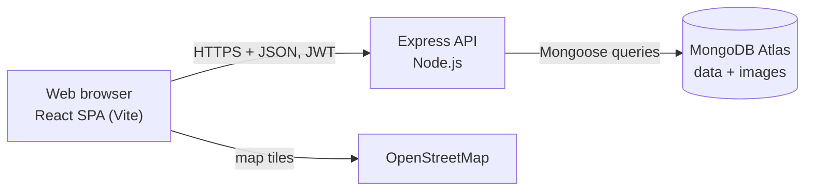
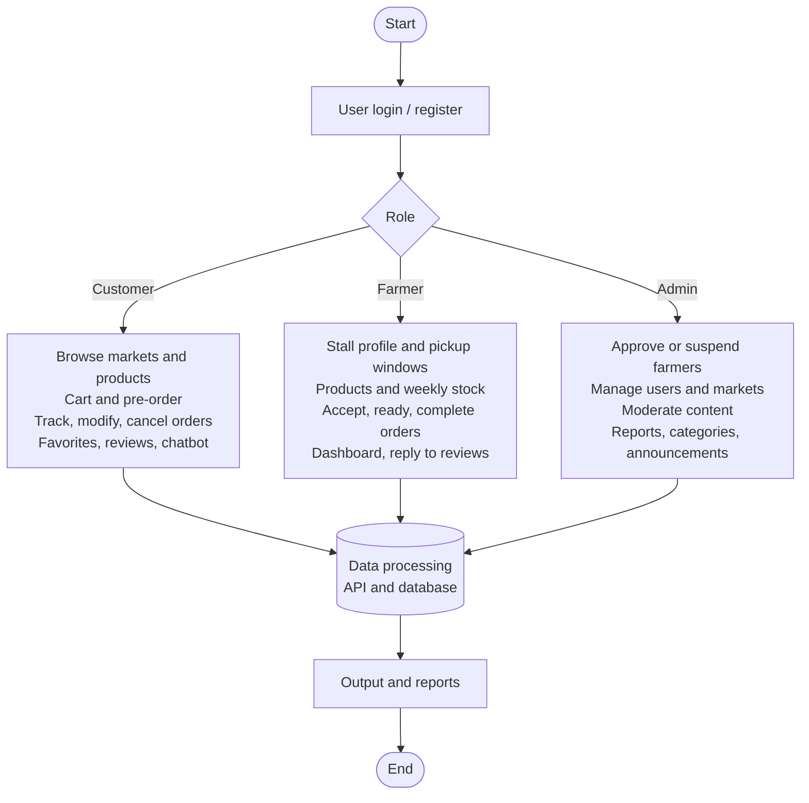
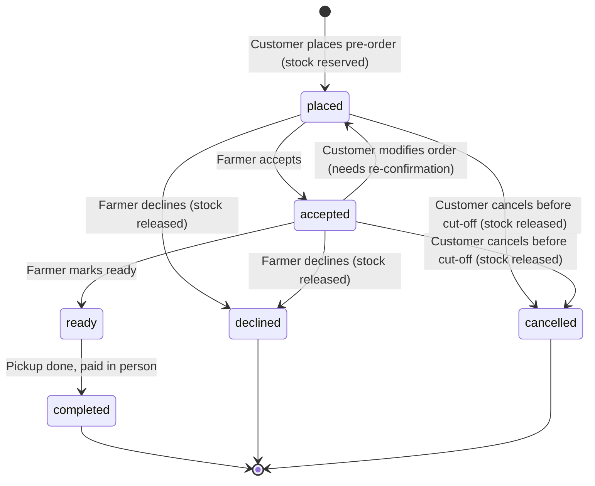
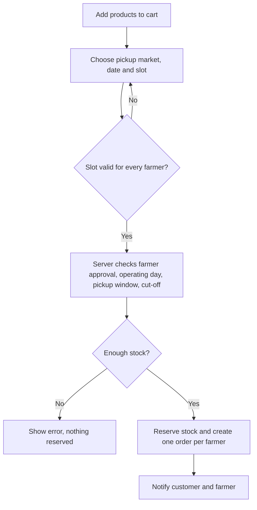
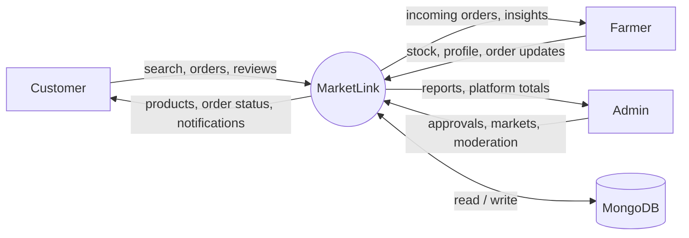
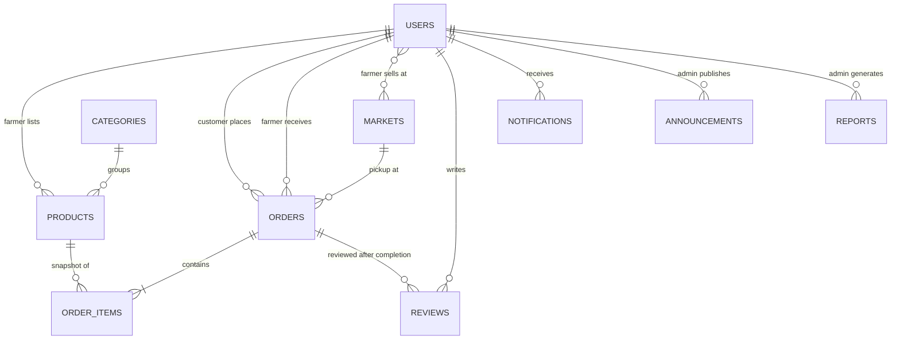

# MarketLink - Problem Definition and Design

## 1. Problem definition
Shoppers at local farmers markets rarely know in advance which farmers will be there, what they have in stock
or at what price. Farmers have no easy way to publish weekly stock, take pre-orders or build a relationship with
regular customers. MarketLink is a full-stack web application (MongoDB, Express, React, Node.js) that brings
farmers and customers together: farmers publish stock and manage pre-orders, customers discover markets on a map,
reserve items for pickup and leave reviews, and an administrator manages users, markets and content.

Out of scope (per the SRS): online payment (paid in person at pickup), delivery, and verification of a farmer's
identity or food-safety certification.

## 2. Architecture

- **Client:** React single-page app; pages load on demand; Leaflet + OpenStreetMap for maps.
- **Server:** REST API under `/api`; controllers hold the business rules, routes map URLs, middleware handles
  authentication (JWT), role checks and errors.
- **Database:** MongoDB collections described in `DATABASE_DESIGN.md`.

## 3. Roles and main flow

## 4. Order life cycle

Rules enforced by the server: stock is taken atomically when an order is placed, the pickup date must be an
operating day and the slot inside a pickup window, and changes are blocked after the farmer's cut-off time.

## 5. Placing a pre-order (activity flow)

## 6. Data flow (level 0)

## 7. Entity relationships

`ORDER_ITEMS` is an embedded array inside `orders`, not a separate collection.

## 8. Key design decisions
- **JWT authentication** with role-based route guards on both server and client.
- **Snapshots in orders** (name, unit, price) so later price edits do not change order history.
- **Optimistic stock control:** conditional atomic updates prevent overselling; failures roll back.
- **Own database name** (`MONGO_DB_NAME`) so the app never shares a database with other projects.
- **Rule-based chatbot** answers from live data (products, markets, farmers); the SRS lists AI as optional.
